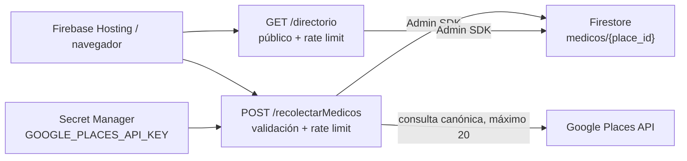

# Arquitectura del directorio médico

## Límites de confianza

- Firestore niega toda lectura y escritura directa de clientes; solo las Functions usan Admin SDK/IAM.
- El directorio es lectura pública y no consume Google Places.
- La UI envía solamente `especialidad` y `zona`; el servidor genera `<especialidad> zona <número> Ciudad de Guatemala` y rechaza campos adicionales.
- El rate limit es una mitigación aproximada por peer y por instancia. No autentica usuarios ni convierte el endpoint de recolección en privado.
- Ningún control confía en `X-Forwarded-For` aportado por el cliente.
- `GOOGLE_PLACES_API_KEY` permanece en Secret Manager y solo se vincula a `recolectarMedicos`.

Los límites operativos están en [rate-limit.md](./rate-limit.md), y la decisión de retirar la whitelist de aplicación está en [ip-whitelist.md](./ip-whitelist.md).
