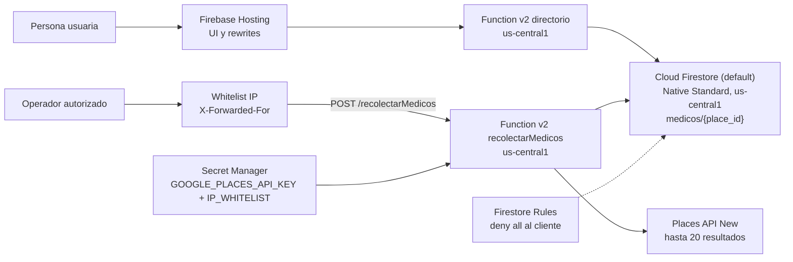

# Arquitectura y flujo operativo

Proyecto objetivo: `proyecto1responsibleai`  
Región configurada para Functions: `us-central1`

El diagrama describe la arquitectura lógica. Functions, Firestore y Hosting fueron verificados juntos en Firebase Emulator Suite. Después de integrar la whitelist se verificó mediante Hosting que loopback atraviesa el middleware hasta el handler (HTTP 405 para un GET), una IP no autorizada recibe 403 y `directorio` continúa público con 200; no se repitió una recolección POST real para evitar consumo innecesario de Places. En cloud ya están habilitadas las APIs necesarias, Firestore `(default)` existe en `us-central1` y Secret Manager contiene una key dedicada restringida a Places. La whitelist está implementada en código para la ruta de recolección y `IP_WHITELIST` tiene una versión cloud habilitada. Functions, Hosting y URLs de producción no se documentan como desplegados sin evidencia.

## Responsabilidades

| Componente | Responsabilidad | Estado comprobado |
|---|---|---|
| Hosting/UI | consulta de directorio y apartado de recolección; este envía POST y vuelve a consultar Firestore | UI verificada previamente; rewrite y control 405/403/200 verificados tras integrar la whitelist |
| `directorio` | validar GET, filtrar por especialidad/zona, ordenar y paginar | Unitarias + emulador + navegador |
| `recolectarMedicos` | aplicar whitelist, validar POST, limitar a 20, llamar Places y guardar idempotentemente | Whitelist implementada en código; pruebas locales reales de Places hechas anteriormente |
| Firestore `medicos/{place_id}` | identidad estable y persistencia con merge | Emulador verificado; cloud `(default)` Native Standard creado en `us-central1` con delete protection |
| Secret Manager | entregar la key y el arreglo `IP_WHITELIST` solo a `recolectarMedicos` | `GOOGLE_PLACES_API_KEY` verificada; `IP_WHITELIST` v1 ENABLED |
| Places API (New) | fuente externa de los campos permitidos | Habilitada; `SearchTextRequest` limitado a 100/día; hubo pruebas locales reales previas |
| Whitelist IP | rechazar con 403 antes de negocio/Firestore/Places | Implementada; secreto local preparado y secreto cloud v1 habilitado; despliegue pendiente |
| Limitador de ráfagas | responder 429 `RATE_LIMITED` cuando se excede el ritmo, en ambas Functions | Implementado en código con pruebas unitarias; best-effort por instancia; despliegue pendiente |

## Límites de confianza

La UI no accede directamente a Firestore. `firestore.rules` aplica una postura `deny all` a clientes; las Functions usan el Admin SDK, cuyo acceso cloud se controla por IAM y no por esas reglas. El secreto no debe entrar al cliente, logs, respuestas HTTP ni repositorio. Solo la función recolectora lo necesita.

En local, `.secret.local` contiene direcciones loopback para los emuladores y está ignorado por Git. No representa una whitelist de producción. La UI local incluye una tarjeta de recolección que envía `keyword`, `especialidad` y `zona`; después consulta `GET /directorio` para reflejar lo que quedó guardado.

## Flujo de consulta

1. La UI solicita `GET /directorio` mediante Hosting.
2. `directorio` valida `page`, `pageSize` (máximo 50), `especialidad` y `zona`; no aplica whitelist en este alcance.
3. Firestore filtra y ordena por `nombre` y `place_id`.
4. La UI muestra fecha de recolección, tabla y navegación Anterior/Siguiente.

La paginación numérica es aceptable para el directorio académico pequeño; a escala debe migrar a cursores para evitar lecturas descartadas por offsets.

## Flujo de recolección

1. Un operador autorizado envía keyword, zona y especialidad explícita desde la UI o mediante la API.
2. La whitelist implementada toma la primera IP de `X-Forwarded-For` y rechaza IP no autorizada antes de leer la key, consumir Places o acceder a Firestore. Este modelo académico supone un ingreso administrado confiable; las URLs reales de Function y Hosting deben probarse frente a headers aportados por el cliente antes de afirmar seguridad de producción.
3. La Function validará método, content type, tipos y longitudes.
4. Places devolverá como máximo 20 candidatos con field mask limitado.
5. La Function conservará solo campos devueltos, sin inferencias, y escribirá por `place_id`.
6. La UI vuelve a consultar el directorio; los conteos y uso de cuota se documentan en [keywords.md](./keywords.md).

La gestión cloud de `IP_WHITELIST` y el despliegue posterior se documentan en [ip-whitelist.md](./ip-whitelist.md). La versión 1 del secreto está habilitada, pero no se afirma un despliegue cloud de Functions o Hosting en este documento.

## Dos controles distintos: whitelist y restricción de key

La **whitelist del endpoint** es un control de entrada: compara la IP que proporciona la cadena de ingreso de una Function y responde 403 antes de negocio. Reduce quién puede iniciar recolección bajo el límite de confianza documentado, pero no es inmune a suplantación en toda topología ni impide que una key robada se use directamente contra Places. Para producción se requiere verificar el ingreso exacto o aplicar Cloud Armor/un proxy controlado que reescriba un header confiable.

El **limitador de ráfagas** es un tercer control con otro eje: no decide quién llama ni dónde vale la credencial, sino a qué ritmo se atiende. Vive en memoria de cada instancia, así que acota ráfagas pero no garantiza un total por ventana ni sostiene un presupuesto diario; esa función la cumple la cuota de Places del lado de Google. Sus límites declarados y lo que explícitamente no garantiza están en [rate-limit.md](./rate-limit.md).

La **restricción de la API key** controla dónde puede usarse la credencial. Debe restringirse a Places API (New). Restringir además por IP de salida solo es viable si Functions dispone de egress estático (por ejemplo, red/NAT), infraestructura no aprobada por su costo y complejidad. La restricción por API tampoco reemplaza la whitelist: no identifica al cliente que llama el endpoint.

Estado actual: la key dedicada del proyecto número `487068590350` tiene target únicamente `places.googleapis.com`; `GOOGLE_PLACES_API_KEY` resuelve en `latest` a la versión 2 ENABLED. La versión anterior, que pertenecía a otro proyecto, no fue eliminada. Egress estático **NO CONFIGURADO**. La whitelist de entrada está implementada solo para `recolectarMedicos`; `IP_WHITELIST` v1 está ENABLED y su vinculación efectiva queda pendiente del despliegue de esa Function.
