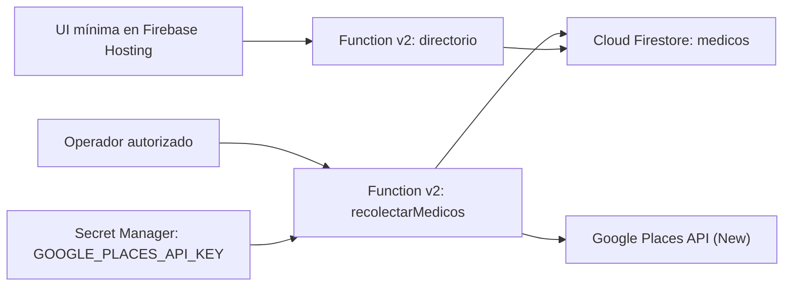

# Diseño del Directorio de Médicos Especialistas

**Fecha:** 2 de agosto de 2026
**Proyecto Firebase/GCP:** `proyecto1responsibleai`
**Región:** `us-central1`
**Estado:** aprobado para planificación técnica

## Objetivo

Construir un sistema académico que recolecte hasta 20 médicos especialistas por invocación desde Google Places API (New), almacene los resultados sin duplicados en Cloud Firestore, los exponga mediante una API HTTP paginada y los muestre en una interfaz mínima desplegada en Firebase Hosting.

El sistema debe favorecer el desarrollo local, limitar el gasto, conservar únicamente datos entregados por Google Places y documentar claramente sus límites técnicos y éticos.

## Alcance

El proyecto incluye:

- Infraestructura de Firebase y Google Cloud necesaria para Functions v2, Firestore, Hosting, Secret Manager y Places API (New).
- Una función HTTP v2 para recolectar médicos a partir de `keyword` y `zona`.
- Una función HTTP v2 para `GET /directorio`, con paginación y filtros.
- Una interfaz web mínima de búsqueda, filtros, tabla y paginación.
- Pruebas unitarias y pruebas locales de integración con Firebase Emulator Suite.
- Datos reales obtenidos mediante una ejecución controlada de Places después de configurar cuotas.
- Documentación técnica de máximo cinco páginas, diagrama de arquitectura, postura ética, estrategia de keywords y material para una presentación de 20 minutos.

La whitelist de IP requerida por el curso se implementará en una fase posterior, cuando el usuario proporcione las IP públicas autorizadas. No se considerará listo el despliegue final ni el entregable de seguridad de Semana 1 hasta que esa fase esté terminada.

## Restricciones globales

- Lenguaje: TypeScript.
- Runtime: Node.js 22.
- Backend: Firebase Functions v2.
- Base de datos: Cloud Firestore en modo Native y región `us-central1`.
- Hosting: Firebase Hosting.
- Límite de recolección: 20 resultados por invocación.
- `pageSize`: valor máximo 50.
- Desarrollo: al menos 90 % con emuladores y respuestas de Places simuladas.
- Producción: únicamente para pruebas finales y demostración.
- Secreto: la API key nunca se guarda en código, commits, logs ni respuestas HTTP.
- Datos: no se agregan ni infieren datos que no provengan de Places.
- Identidad: `place_id` es la clave estable y el ID de cada documento.

## Facturación y control de gasto

Cloud Billing confirmó que `proyecto1responsibleai` tiene la facturación habilitada y está vinculado a la cuenta de facturación indicada por el usuario. La pantalla de Administración de cuentas proporcionada por el usuario muestra el mismo vínculo.

La evidencia disponible no muestra el saldo restante ni la fecha de vencimiento del crédito promocional de USD 300. Antes de habilitar servicios que generen consumo o ejecutar una llamada real a Places, se debe comprobar visualmente en Google Cloud Console:

1. Saldo y vencimiento del crédito promocional.
2. Presupuesto aplicable al proyecto.
3. Alertas al 50 % y 90 %.
4. Cuota diaria de Places API (New).

Las alertas notifican gasto, pero no detienen automáticamente el consumo. La cuota diaria será el control efectivo principal para Places. La documentación final explicará que el antiguo crédito recurrente de USD 200 de Google Maps Platform fue reemplazado en 2025 por límites gratuitos mensuales por SKU.

## Arquitectura



Se usarán dos funciones desplegables desde el mismo código fuente:

- `recolectarMedicos` concentra validación, consumo de Places, normalización permitida y escrituras idempotentes.
- `directorio` concentra filtros, paginación, serialización y acceso de solo lectura a Firestore.

Esta separación impide que cambios en la API de consulta mezclen accidentalmente lógica que consume Places o modifica datos. También permite aplicar configuración, secretos y límites diferentes a cada función.

## Flujo de recolección

1. El cliente envía una solicitud `POST` con `keyword` y `zona` no vacíos.
2. La función valida tipos, longitud y método HTTP antes de acceder a servicios externos.
3. La función construye la consulta documentada y solicita un máximo de 20 resultados a Places API (New).
4. Se utiliza un field mask explícito con los campos necesarios para el entregable. La selección final se documenta junto con el SKU que active.
5. Cada resultado se transforma sin inferir datos ausentes.
6. Firestore guarda cada médico en `medicos/{place_id}` mediante escritura con merge.
7. La respuesta informa la keyword, zona y cantidades encontradas, creadas y actualizadas; nunca incluye la API key.

Una solicitud inválida no ejecuta Places ni Firestore. Un fallo parcial de escritura se reporta como error controlado y se registra sin datos secretos.

## Contrato de recolección

Solicitud:

```http
POST /recolectarMedicos
Content-Type: application/json

{
  "keyword": "pediatra zona 10 Ciudad de Guatemala",
  "zona": "10",
  "especialidad": "Pediatría"
}
```

Respuesta exitosa:

```json
{
  "keyword": "pediatra zona 10 Ciudad de Guatemala",
  "zona": "10",
  "especialidad": "Pediatría",
  "encontrados": 20,
  "creados": 18,
  "actualizados": 2
}
```

Aunque el enunciado exige keyword y zona, `especialidad` se recibe explícitamente para evitar inferirla a partir de texto libre.

## Modelo de Firestore

Colección: `medicos`
ID del documento: valor de `place_id`

```ts
interface Medico {
  nombre: string;
  especialidad: string;
  direccion: string;
  telefono: string;
  sitio_web: string;
  zona: string;
  place_id: string;
  fecha_recoleccion: FirebaseFirestore.Timestamp;
  keyword_usado: string;
}
```

Los campos `telefono` y `sitio_web` se guardan como cadena vacía si Places no devuelve un valor. `sitio_web` puede corresponder a una clínica y no necesariamente al profesional. No se aceptan redes sociales agregadas manualmente ni datos obtenidos fuera de Places.

## API de directorio

Ruta pública del backend: `GET /directorio`.

Parámetros:

- `page`: entero mínimo 1; predeterminado 1.
- `pageSize`: entero entre 1 y 50; predeterminado 20.
- `especialidad`: filtro opcional por coincidencia exacta normalizada.
- `zona`: filtro opcional por coincidencia exacta normalizada.

Respuesta:

```json
{
  "data": [],
  "pagination": {
    "page": 1,
    "pageSize": 20,
    "returned": 0,
    "hasNextPage": false
  },
  "filters": {
    "especialidad": null,
    "zona": null
  }
}
```

La consulta utiliza orden estable por `nombre` y `place_id`. Como el contrato académico exige número de página, la primera versión usará paginación numérica de Firestore adecuada para el tamaño reducido del directorio. La documentación advertirá que una producción de gran escala debe migrar a cursores para evitar lecturas descartadas.

## Interfaz web

La UI tendrá:

- Campo de búsqueda por especialidad.
- Selector o campo de zona.
- Botón de búsqueda.
- Tabla con nombre, especialidad, dirección, teléfono, sitio web, zona y fecha de recolección.
- Botones Anterior y Siguiente.
- Estados visibles de carga, error y cero resultados.
- Aviso de que el directorio es una referencia y no una validación médica.

No se incluirán autenticación de usuarios, panel administrativo, edición manual de médicos, mapas, diseño avanzado ni exportaciones en la primera versión.

## Estrategia inicial de keywords

Las primeras especialidades serán Pediatría, Cardiología y Dermatología. Las zonas iniciales serán 1, 9 y 10 de Ciudad de Guatemala.

Ejemplos:

- `pediatra zona 10 Ciudad de Guatemala`
- `clínica pediátrica zona 1 Guatemala`
- `cardiólogo zona 9 Ciudad de Guatemala`
- `clínica cardiológica zona 10 Guatemala`
- `dermatólogo zona 10 Ciudad de Guatemala`

Pediatría será el recorrido principal de la demostración por ser una especialidad frecuente y fácil de explicar. La matriz completa registrará especialidad, zona, keyword, fecha de ejecución y cantidad obtenida para hacer reproducible la cobertura.

## Seguridad

- `GOOGLE_PLACES_API_KEY` se almacena en Secret Manager y solo se vincula a `recolectarMedicos`.
- La key se restringe a Places API (New).
- `.env` permanece local y se agrega a un `.gitignore` del repositorio.
- Los errores y logs no muestran secretos ni cuerpos completos de proveedores externos.
- Se validan método, content type, tipos, longitudes, página y tamaño antes de cualquier operación.
- La whitelist de IP se añadirá como middleware compartido cuando existan IPs autorizadas. Una solicitud rechazada devolverá 403 antes de ejecutar lógica de negocio.
- Restringir la API key por IP de salida requeriría una IP estática mediante red/NAT; no se añadirá esa infraestructura sin una decisión explícita por su costo y complejidad. La restricción por API y Secret Manager sí es obligatoria.

## Manejo de errores

- `400`: parámetros inválidos o ausentes.
- `403`: IP no autorizada, una vez habilitada la whitelist.
- `405`: método HTTP no permitido.
- `415`: content type incorrecto en recolección.
- `429`: cuota o límite externo alcanzado.
- `502`: Places respondió con un error válido pero no procesable.
- `500`: fallo interno inesperado.

Las respuestas usan un formato uniforme con `error.code` y `error.message`. Los mensajes públicos no incluyen trazas internas.

## Pruebas

Las unidades de lógica se diseñarán con dependencias inyectables para probarlas sin red:

- Validación de solicitudes de recolección.
- Límite máximo de 20 resultados.
- Mapeo de campos vacíos sin inferencias.
- Escritura idempotente por `place_id`.
- Validación de `page` y `pageSize`.
- Filtros por especialidad y zona.
- Métodos HTTP y formato uniforme de errores.
- Whitelist y corte temprano cuando se implemente.

Las pruebas de integración usarán los emuladores de Functions, Firestore y Hosting. Places será simulado durante el desarrollo. Solo después de verificar billing, presupuesto, alertas, cuota y restricciones se ejecutará una prueba real controlada.

## Entregables y criterios de aceptación

### Semana 1

- Proyecto configurado y vinculado a billing.
- Captura de alertas al 50 % y 90 %.
- Función mínima desplegada.
- Whitelist funcionando después de recibir las IPs.

### Semana 2

- Recolección operativa con máximo 20 resultados.
- Estrategia de keywords documentada.
- Colección Firestore con datos reales controlados.

### Semana 3

- API paginada con filtros y validaciones.
- UI accesible mediante Firebase Hosting.

### Semana 4

- Documento técnico de máximo cinco páginas.
- Diagrama de arquitectura.
- Postura ética.
- Presentación y guion de demo de 20 minutos.

El proyecto se considera terminado cuando las pruebas locales pasan, la prueba real respeta las cuotas, los endpoints desplegados cumplen sus contratos, la whitelist rechaza IPs no autorizadas, la UI presenta los datos y todos los entregables están versionados sin secretos.

## Postura ética preliminar

El directorio reproduce información entregada por Google Places con fecha de recolección y no certifica credenciales médicas. No infiere campos faltantes, no mezcla fuentes externas y documenta que un sitio web puede representar a una clínica. Los datos se usan con alcance académico y no se presentan como un producto independiente ni como sustituto de orientación médica profesional.
